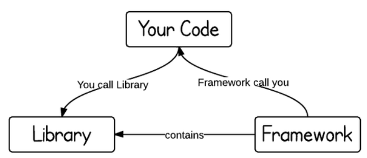

## C# 과 .Net 에 대한 이해

Unity 엔진에서 사용하는 

> C#은 .Net 위에서 실행되는 어플리케이션을 빌드할 수 있는 언어이다.
>
> 

그렇다면, .Net은 무엇일까? 얼마 전 게임을 실행할 때, 아래 캡쳐에서 처럼 .Net 설치오류로 귀찮았던 기억이 있다.

[그림출처: Microsoft Docs]

> .Net은 마이크로소프트에서 개발한 Windows 프로그램 개발 및 실행환경(프레임워크)이다.

## 프레임워크와 라이브러리의 차이

그렇다면, 프레임워크(Framework)란 무엇일까? 

> 프레임워크(Framework)는 소프트웨어의 구체적인 부분을 설계, 구현할 때 재사용이 가능하게끔 일련의 협업화된 형태로 클래스들을 제공하는 것을 말한다.

그렇다면, 프레임워크와 비슷한 라이브러리는 어떻게 정의할 수 있을까?

> 라이브러리는 자주 사용되는 로직을 재사용이 가능하게끔 정리해둔 코드들의 집합이라 할 수 있다.

프레임워크와 라이브러리의 개념을 이해하기 위해, 자동차를 제작하는 것에 비유하자면

자동차의 뼈대 역할을 하는 것을 프레임워크가 하고, 이 자동차를 구성하는 파츠(유리, 네비게이션, 문 등)를 라이브러리를 통해 불러와 붙일 수 있다. 여기서, 프레임워크의 장단점을 이해할 수 있는데, 만약 프레임워크가 4WD 라면 세단과 SUV같은 4륜 자동차를 만들 수 있겠지만 오토바이와 같은 2륜 차량은 만들 수 없는 한계가 있다. 프레임워크의 장단점은 아래와 같다.

- 프레임워크의 장점:
  - 개발 편의성이 올라 시간을 절약할 수 있다.
  - 오류의 폭을 좁힐 수 있다.
  - 코드의 품질을 어느정도 보장한다.
  - 유지 보수하기 좋다.

- 프레임워크의 단점:
  - 프레임워크의 의존도가 올라가 개발 능력이 저하될 수 있다.
  - 개발자의 자유도가 떨어진다.

한 마디로 프레임워크는 라이브러리에 비해 개발자의 환경을 제한하는 대신에 일정한 환경을 제공한다고 볼 수 있다.

## 제어의 역전(Inversion of Control)

제어의 역전은 프레임워크와 라이브러리의 차이 중 하나이다.

라이브러리는 어플리케이션 코드 안에 포함하여 불러올 수 있으며, 어플리케이션 코드에 의해 라이브러리를 불러올 수 있다.

하지만, 프레임워크에서 어플리케이션 코드는 프레임워크에 의해 불러와진다.

이러한 주도성의 역전 현상을 '제어의 역전(Inversion of Control)'이라고 한다.

그렇다면, 어떻게 해서 프레임워크는 어플리케이션 코드를 불러올 수 있는걸까? 바로 '의존성 주입(Dependency Injection)'에 의해 가능하다. 의존성 주입이란 쉽게 말하면 객체들을 정리해놓은 메타데이터를 외부에서 주입해주는 것이 DI이고 이 주입받은 것을 통해서 프레임워크에 의해 어플리케이션 코드가 실행되는 원리로 단순하게나마 이해할 수 있다.

